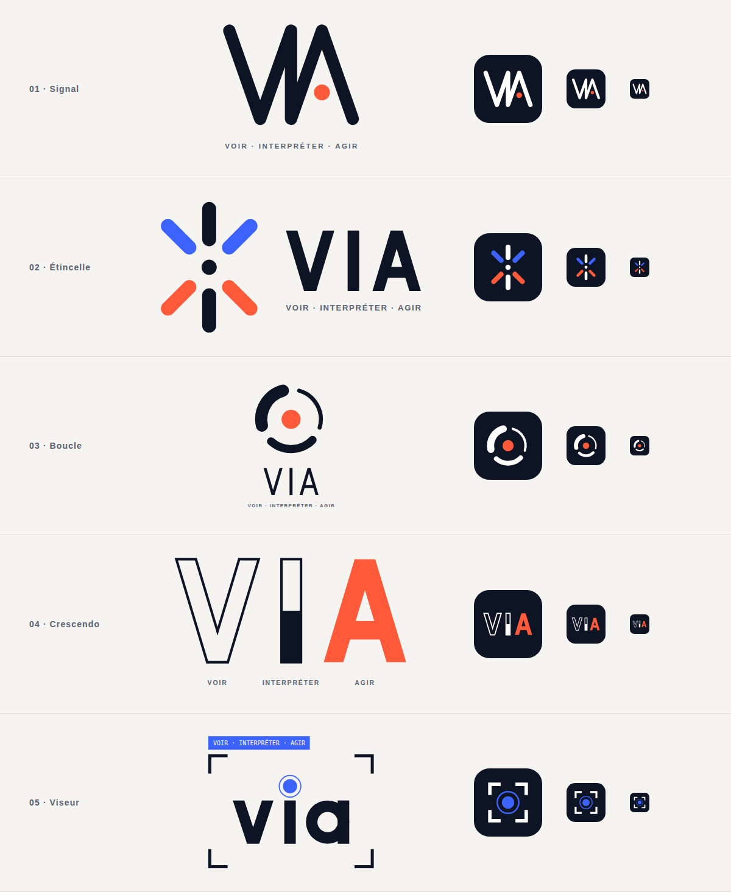

# VIA : pistes de logo

**VIA** = **V**oir · **I**nterpréter · **A**gir, la stratégie d'implémentation de l'IA dans le Groupe.

Chaque piste existe en deux fichiers SVG vectoriels :

- `via-0N-<nom>.svg` : logo principal (fond transparent, pour fond clair) ;
- `via-0N-<nom>-icon.svg` : icône carrée (avatar, app, favicon).

| # | Piste | Idée |
|---|-------|------|
| 01 | **Signal** | Un seul trait continu dessine V, I et A, comme une onde de données. Le point corail remplace la barre du A : c'est le moment où l'on passe à l'action. |
| 02 | **Étincelle** | Un symbole en étoile construit avec les trois lettres : le V en haut (bleu, voir), le I vertical (encre, interpréter) et le A en bas (corail, agir), autour d'un noyau commun. |
| 03 | **Boucle** | Trois arcs de plus en plus épais forment un cycle continu, et le point central en fait aussi un œil. On voit, on interprète, on agit, puis on recommence. |
| 04 | **Crescendo** | Le V est en contour, le I à moitié rempli, le A plein : on passe de l'observation à l'action. Le logo explique lui-même la démarche. |
| 05 | **Viseur** | « via » en minuscules dans un cadre de détection, comme en vision par ordinateur. Le point du i sert de mire, et l'étiquette porte la devise. |

## Palette

| Rôle | Couleur |
|------|---------|
| Encre | `#0D1424` |
| Papier | `#F5F4F0` |
| Bleu | `#3D63FF` |
| Corail | `#FF5B3A` |
| Texte secondaire | `#5A6275` |

Typographies des accroches : **Manrope** (600/700) et **JetBrains Mono** (piste 05), toutes deux sur Google Fonts. Les lettres « VIA » sont dessinées en formes géométriques, sans dépendre d'une police. Seules les accroches sont en texte.
